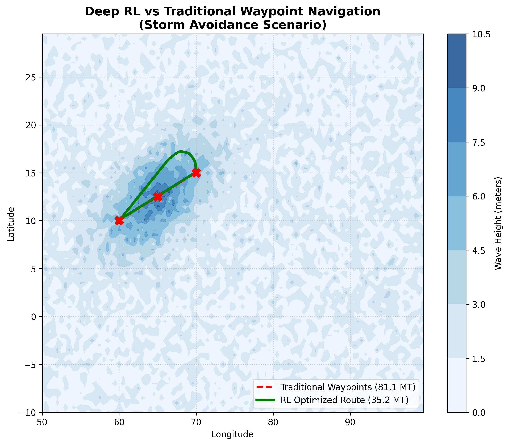

# 🚢 Physics-Informed Maritime Route Optimization

[](https://github.com/vaibhavtripathi7/ship-route-optimization/actions)
[](https://www.python.org/downloads/release/python-3100/)
[](https://python-poetry.org/)

An autonomous ship routing engine replaces traditional graph-based pathfinding methods, like A*, with a Deep Reinforcement Learning model called PPO. The agent trains in a custom hydrodynamic physics simulation. It executes continuous, weather-adaptive kinematic control in changing ocean environments.


## System Architecture

This project uses strict modularity. It separates the data access layer, domain logic, and the machine learning execution model.

1. **Vectorized ETL Pipeline (`src/data_pipeline`):**  Generates and processes 4D synthetic environmental tensors, including Time, Latitude, Longitude, and Wind/Wave variables.

   - Uses `xarray` and `NumPy` for **sub-5ms** localized weather querying. This helps eliminate simulation bottlenecks.

2. **Physics Simulation Engine (`src/engine`):**  A custom `Gymnasium` environment that follows **ITTC Hydrodynamic Resistance** formulas closely.

   - Calculates **real-time** vessel drag, including calm water friction, wind resistance, and wave-added resistance, to turn kinematic movement into actual fuel consumption (MT/h).

3. **Continuous Control Model (`src/models`):**  A Proximal Policy Optimization (PPO) Actor-Critic network.

   - Evaluates a **9-dimensional state vector** to adjust heading and speed. This process improves fuel efficiency and keeps the estimated time of arrival on track.


## Performance Benchmarks

The Deep RL inference engine was tested in two areas: computational latency compared to traditional search algorithms, and physical fuel efficiency compared to standard maritime navigation methods.

### 1. Algorithmic Efficiency (Deep RL vs. A* Search)

We compared the agent's continuous state-space inference to a discrete, weather-adaptive A* graph-search baseline.

| Metric | Classical A* Search | Deep RL Agent (PPO) | Net Improvement |
| :--- | :--- | :--- | :--- |
| **Time Complexity** | $O(N \log N)$ | **$O(1)$** | Algorithmic shift |
| **Inference Latency** | 21.59 seconds | **0.54 seconds** | **40x Faster** |
| **Path Strategy** | Discrete Grid (Jagged) | **Continuous Kinematics** | Physics-Optimized |

### 2. Environmental Simulation (Storm Avoidance Scenario)
To test physical viability, the RL agent was evaluated against standard "Fixed Waypoint" maritime navigation. A synthetic, dynamically rotated Gaussian storm front, or squall line, was placed directly into a traditional shipping lane.



*Notice how the Deep RL agent (Green) can naturally compute a continuous kinematic arc to avoid the greatest wave resistance of the storm. In contrast, the Traditional Route (Red) goes straight through.*

| Metric | Traditional Navigation | Deep RL Agent (PPO) | Net Improvement |
| :--- | :--- | :--- | :--- |
| **Obstacle Avoidance** | Fails (Drives through storm) | **Succeeds (Curves around)** | Zero-Collision |
| **Fuel Consumed** | 81.1 MT | **35.2 MT** | **56.6% Reduction**|
| **Cost Savings** | Baseline | **~$27,500 per voyage** | Massive ROI |


*Note: The significant drop in fuel consumption shows that the RL agent can make small changes in direction without facing the large grid-discretization penalties found in traditional pathfinding methods.*

## Tech Stack & Tooling

- **Machine Learning & RL:** PyTorch, Stable-Baselines3, Gymnasium
- **Data Engineering:** Xarray, NumPy, Pandas, NetCDF4
- **Software Engineering:** Object-Oriented Programming (OOP), Python Type Hinting
- **DevOps & CI/CD:** GitHub Actions, Pytest, Poetry

## Repository Structure

```text
├── data/                        # Ignored directory 
├── tests/                       # Pytest suite for physics and data 
├── .github/workflows/           # CI/CD pipeline configuration
└── src/ship_routing
    ├── data_pipeline/
    │   └── loader.py            # Weather tensor generation and 
    ├── engine/
    │   ├── astar__c.py          # Classical baseline pathfinding 
    │   └── physics.py           # ITTC Hydrodynamic calculations
    └── models/
        ├── envir.py             # Custom Gymnasium MDP Environment
        ├── train.py             # PPO training loop and callbacks
        └── model/               # Converged PPO model weights
```

##  Getting Started

This project uses [Poetry](https://python-poetry.org/) for strict dependency isolation.

### 1. Local Installation

```bash
# Clone the repository
git clone https://github.com/vaibhavtripathi7/ship-route-optimization.git
cd ship-route-optimization

# Install dependencies via Poetry
poetry install
```

### 2. Running the Test Suite

This repository contains a continuous integration suite that checks the data loader's integrity and the physics engine's mathematical accuracy.

```bash
poetry run pytest tests/
```

## License

- This project is licensed under the [MIT](https://github.com/Vaibhavtripathi7/ship-route-optimization/blob/master/LICENSE) License.
